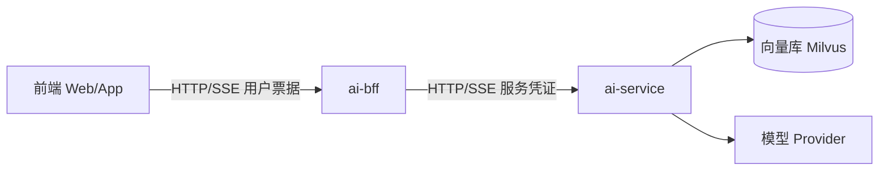

# 10.01 BFF 模式 · 实跑记录


## 边界图（Mermaid）



## ASCII

```
[前端] --用户票据--> [ai-bff] --服务凭证--> [ai-service] --> [Milvus/模型]
   |                      |                      |
 展示/SSE              鉴权/转发              RAG/Agent
  ✗ 无模型密钥          ✗ 无向量逻辑           ✗ 不管 Cookie 细节
  ✗ 不直连向量库
```

## STEP 1 · 骨架

- `README.md` exists=True
- `requirements.txt` exists=True
- `.env.example` exists=True
- `app/config.py` exists=True
- `app/layers.py` exists=True
- `app/main.py` exists=True
- `scripts/10_01_bff_pattern_demo.py` exists=True

## STEP 2 · 三层

| 层 | 职责 | 不该做 |
|----|------|--------|
| 前端 | 展示、输入、消费 SSE | 持有模型密钥、直连向量库/Milvus |
| ai-bff | 鉴权、限流、参数校验、转发/聚合、统一追踪 | 塞进复杂 Prompt 工程与向量逻辑 |
| ai-service | 模型调用、RAG、Agent、图 | 解析每种前端的 Cookie 细节（可收标准头） |

## STEP 3 · 为何分离

- **安全**：密钥与内网 Tool 留在服务端
- **多端同构**：各端只对接 BFF 契约
- **演进**：换模型/换 Agent 不改前端
- **观测**：在 BFF 统一打点、追踪 id

## STEP 4 · 边界检查

- `{'ok': True, 'forbidden_hits': [], 'has_bff': True, 'has_ai_service': True}`

## STEP 5 · 配置

- AI_SERVICE_BASE_URL=`http://127.0.0.1:8000`
- BFF_PORT=`8088`

## STEP 6 · 反模式

- 前端 .env 塞 OPENAI_API_KEY（前端）→ 密钥只放 BFF 或 ai-service 服务端
- 浏览器直连 Milvus（前端）→ 向量访问只在 ai-service
- BFF 里写满 Prompt / Agent Loop（ai-bff）→ Prompt 与 Loop 回 ai-service
- ai-service 解析每种 App 的 Cookie（ai-service）→ BFF 鉴权后下发标准头（租户/用户 id）
- 调试 Tool 用 MCP；上线流量走 BFF → ai-service
